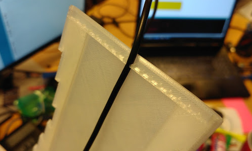

# Installing the electronics

## You will need

* Micro usb cable 
* The printed parts
* The pack of electronics
* Double sided tape

## Step 1

Check the electronics package

Plug it using your usb cable. The animation should start

## Step 2

Place the components into the base

The layout should be similar to the one in the picture. Be careful with using too much force on the wires and the main circuitry

The cable fits into a channel. You can carve a bigger space if needed

## Step 3

Place double sided tape on the 2 sides of the base, near the light strips, and close everything with the plastic body

